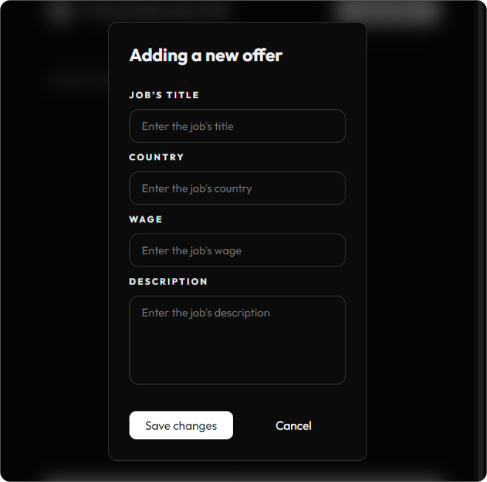
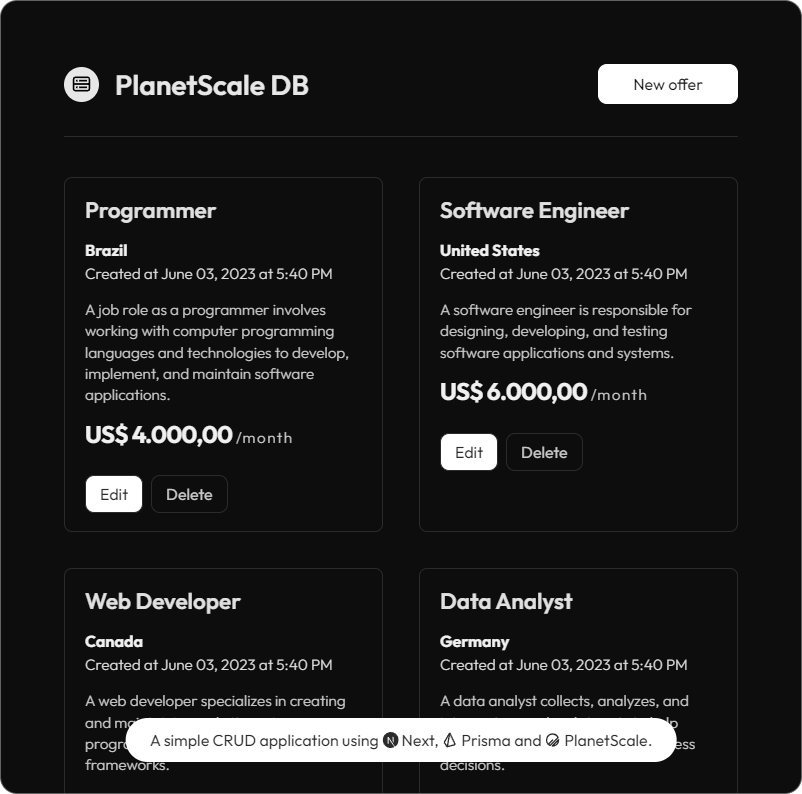

### PlanetScale CRUD

Este é um CRUD que fiz utilizando o framework NextJS 13.4, o ORM Prisma e o PlanetScale como banco de dados.

A principal intenção foi estudar as novas funcionalidades do Next e aprender sobre mais sobre o Prisma e como ele facilita a integração com o banco de dados. O intuito é me familiarizar com as stacks que serão utilizadas no meu Trabalho de Conclusão de Curso (TCC) na ETEC Maria Cristina Medeiros em Ribeirão Pires.

### Guia de uso

- Para instalar as dependências do projeto, digite `npm install` ou `yarn` no seu terminal.

- O caminho `prisma/schema.prisma` conterá informações de modelos e connection strings para você alterar, caso for necessário.

- Será necessário criar um arquivo `.env` na raiz do projeto com o campo `DATABASE_URL` contendo o link para seu banco de dados.

### Imagens do projeto

 

 

